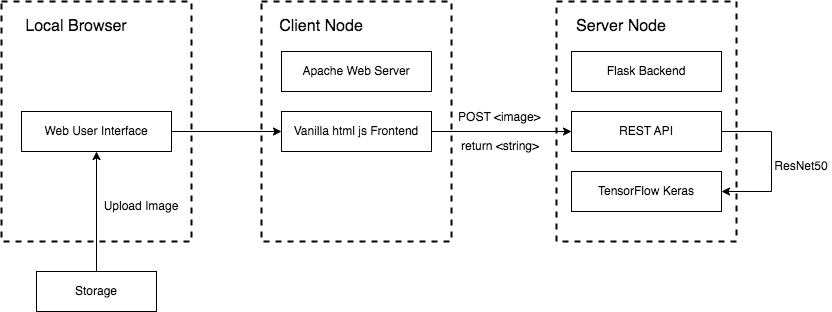

# CS655 Mini Project Report


## Architecture




## Environment Resources

Backend GENI Node: Xen VM, Ubuntu 18.04 LTS, no GPUs, 1024MB RAM, 16G Hard Drive

Frontend GENI Node: Xen VM, Ubuntu 18.04 LTS, no GPUs, 1024MB RAM, 16G Hard Drive


## Deployment Instructions

### Backend:

```bash
# scp backend files from local machine to GENI node
cd 655-proj
scp -r backend lc21fall@pcvm3-9.geni.case.edu:~/

# log into GENI node <backend>
ssh -i ~/.ssh/id_geni_ssh_rsa lc21fall@pcvm3-9.geni.case.edu -p 22

# update apt
sudo apt update

# check python3 version
python3 --version

# check if python3.7 is available for install
apt list | grep python3.7

# install python3.7
sudo apt install python3.7

# check current python3 version
# chances are that you will still see the older python3 version
# because we don't have full permission here
# we'll skip setting python3.7 as system default
python3 --version

# install pip for python3.6
# python3.6 is the system default version for python 3
# executing this command only installs pip for python3.6
# but to install pip for python3.7
# we have to first have pip for python3.6 installed
sudo apt install python3-pip

# install pip for python3.7
python3.7 -m pip install pip

# check pip versions
pip -V
pip3 -V
pip3.7 -V

# pip install packages
pip3.7 install flask
pip3.7 install flask-cors
pip3.7 install pillow
pip3.7 install tensorflow

# open a new tmux session
tmux new -s <session-name>

# enter into tmux session
tmux a -t <session-name>

# start the flask server
cd backend
python3.7 -m flask run --host=0.0.0.0

# hit ctrl+b and then hit d to detach tmux session without killing the process
# the flask process will continue running in the tmux session
```

### Frontend

```bash
# scp backend files from local machine to GENI node
cd 655-proj
scp -r frontend lc21fall@pcvm3-10.geni.case.edu:~/

# log into GENI node <frontend>
ssh -i ~/.ssh/id_geni_ssh_rsa lc21fall@pcvm3-10.geni.case.edu -p 22

# update apt
sudo apt update

# install apache web server and verify the version
sudo apt install apache2
apache2 -version

# start the service
sudo service apache2 start

# replace the index.html file inside directory /var/www/html with your html file inside the ./frontend directory

# restart the apache web service
sudo systemctl restart apache2
```


## Demo Video

<video src="assets/demo.mp4"></video>


